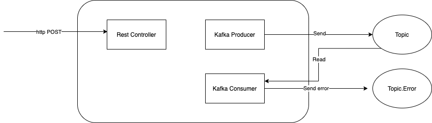

# Kafka Spring Boot Application with Exception Handling example
Demo application to demonstrate `KafkaTemplate` to send and receive messages to kafka topic.
It also has exception handing.

## Architecture Diagram


## Required
* Apache Zookeeper (version 2.7.0) & Apache Kafa. Install instructions are at https://kafka.apache.org/downloads
* JDK 11
* Maven 14+

#### Apache Kafka BootstrapServer URL & Port
* `application.yaml` change the bootstrapServer value to your zookeeper server IP address & port.

    ```
    bootstrapServer: 192.168.86.37:9092
    ```


### References

* [How to Work with Apache Kafka in Your Spring Boot Application](https://www.confluent.io/blog/apache-kafka-spring-boot-application)
* [Spring for Apache Kafka Deep Dive – Part 1: Error Handling, Message Conversion and Transaction Support](https://www.confluent.io/blog/spring-for-apache-kafka-deep-dive-part-1-error-handling-message-conversion-transaction-support)
